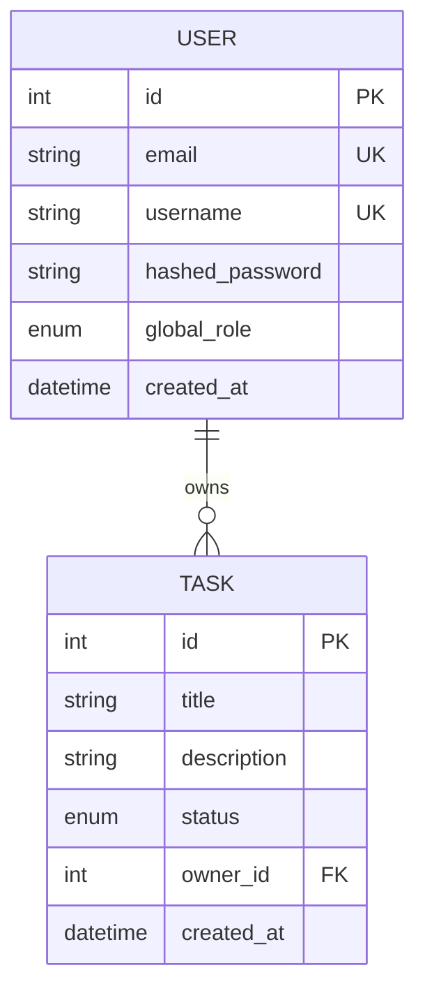

# Taskforge API

[](https://github.com/adeelism/Taskforge-backend/actions/workflows/ci.yml)
[](./LICENSE)

A small task-management backend in **FastAPI + SQLAlchemy 2.0** — a learning
project built up to production hygiene: environment-based config, password
hashing, typed Pydantic schemas, a session dependency, and a pytest suite with
a coverage gate.

## What it does

Users register (with a hashed password) and own tasks. The API covers user
registration and lookup, and task create / list / get / update.

| Method | Path | Purpose |
| --- | --- | --- |
| GET | `/healthy` | Liveness check |
| POST | `/users` | Register a user (password is bcrypt-hashed; never returned) |
| GET | `/users` | List users |
| GET | `/users/{id}` | Get a user |
| POST | `/tasks` | Create a task for an existing owner |
| GET | `/tasks?owner_id=` | List tasks, optionally filtered by owner |
| GET | `/tasks/{id}` | Get a task |
| PATCH | `/tasks/{id}` | Update a task's title/description/status |

Interactive docs are served at `/docs` when running.

## Data model



## Run it locally

Requires Python 3.12 (see `.python-version`).

```bash
python -m venv .venv && source .venv/Scripts/activate   # Windows Git Bash
pip install -r requirements-dev.txt
uvicorn app.main:app --reload                            # http://localhost:8000/docs
```

With no `DATABASE_URL` set, it uses a local SQLite file, so it runs with zero
setup. For Postgres, copy `.env.example` to `.env` and set `DATABASE_URL`.

## Run the tests

```bash
pytest --cov=app --cov-report=term-missing --cov-fail-under=80
```

Tests run against an in-memory SQLite database, so they need no external
services. CI runs `ruff check`, `ruff format --check`, and the covered test
suite on every push and PR.

## Notes on the modernization

This started as a single health endpoint with a `User` model. Bringing it to a
clean baseline involved:

- **Removing a hardcoded database URL and password** from the source; the
  connection string now comes from `DATABASE_URL` (env), with a safe SQLite
  default. Secrets never live in code.
- Fixing a UTF-16 `pip freeze` dump into a curated, readable `requirements.txt`.
- Adding typed Pydantic schemas, a `get_db` session dependency, bcrypt password
  hashing, an error-returning users/tasks API, and a tested SQLite-backed suite.

## License

[MIT](./LICENSE)
